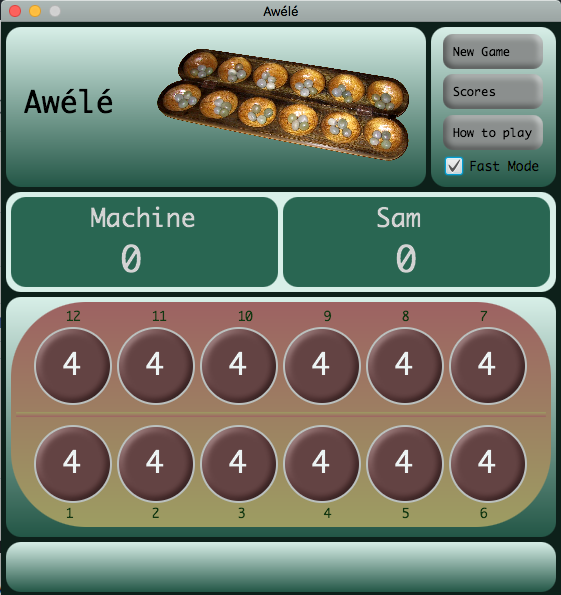

# Awele

Awele is an ancient strategy board game.

This is a two players game (player vs machine) that consists in getting the maximum amount of seeds.

The main objective of this school project was to learn and practice Object Oriented Programming in Java.
The program has been developed in three steps:
* The first step was to create a console version of the game (V0),
* then adding a JavaFX graphical user interface (V1),
* finally, adding a database connection allowing to store the player scores (V2).

This repository contains the last version (V2).

## GUI

